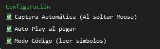
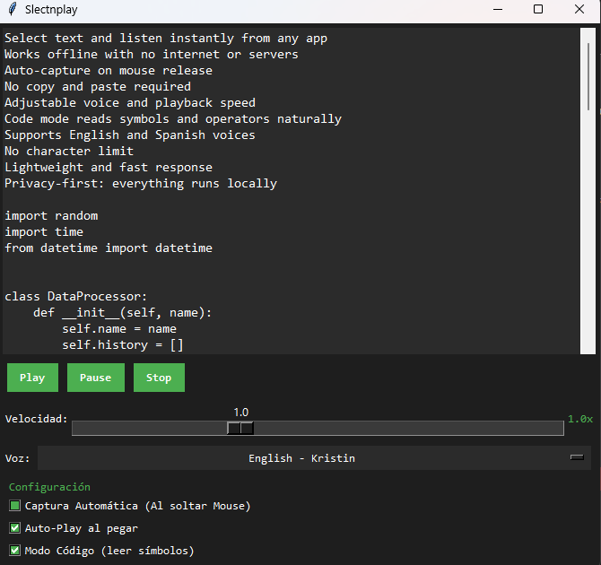
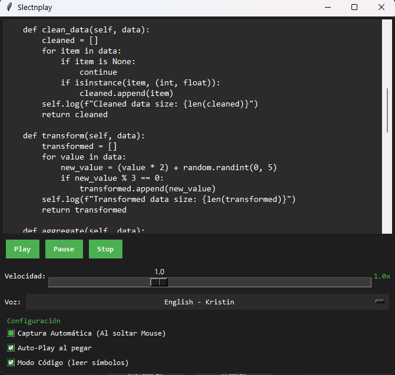

# Slectnplay

## Capturas

Slectnplay es una aplicacion de escritorio para Windows enfocada en Texto a Voz.

Convierte el texto seleccionado en audio al instante cuando el usuario suelta el mouse, ayudando a reducir la fatiga visual y facilitando avanzar por informacion densa sin depender todo el tiempo de la lectura en pantalla.

## Para Que Sirve

Slectnplay esta pensado para personas que pasan largos periodos leyendo, revisando o comparando texto en la computadora.

Es util para:

- Codigo y fragmentos tecnicos
- Logs y salidas de diagnostico
- Documentacion y material de referencia
- Articulos tecnicos y especificaciones
- Lectura de contenido extenso
- Tareas repetitivas de revision donde escuchar puede ser mas rapido que releer

## Capacidades Principales

- Reproduccion inmediata desde texto seleccionado
- Flujo de trabajo de escritorio para Windows
- Texto a Voz sin conexion usando recursos de voz locales
- Soporte bilingue para flujos en ingles y espanol
- Lectura tecnica de simbolos, operadores y tokens comunes de programacion
- Sin procesamiento en la nube para la reproduccion de texto a voz

## Privacidad

Slectnplay esta disenado para ejecutarse localmente.

La aplicacion no recopila, transmite, almacena, vende ni comparte datos del usuario. El texto seleccionado por el usuario se procesa en el dispositivo con el unico proposito de generar salida de audio.

Consulta `docs/privacy.md` para ver la declaracion publica de privacidad.

## Alcance Del Repositorio

Este repositorio es solo para portafolio publico y documentacion de producto.

Slectnplay es una aplicacion de codigo cerrado. Este repositorio no incluye codigo fuente propietario de la aplicacion, modelos de voz locales, instaladores, salidas de compilacion, material de firma, configuracion privada ni logica interna de implementacion.

## Estado Del Producto

Slectnplay esta preparado como producto de escritorio para Windows orientado a distribucion publica y flujos de publicacion en tienda.

## Instalación

Slectnplay se distribuye a través de Microsoft Store.

Los usuarios pueden instalar la aplicación directamente desde la tienda cuando esté disponible.
